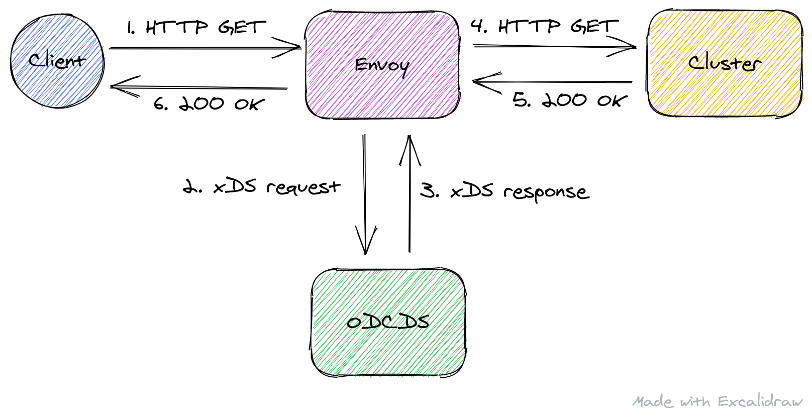

# Test ODCDS

A dummy ODCDS server for Envoy.

## Flow



1. A client sends an HTTP request to Envoy. Envoy doesn't know about the target cluster.
2. Envoy queries the ODCDS server for the cluster configuration using xDS.
3. The ODCDS server returns the cluster configuration.
4. Envoy sends an HTTP request to the cluster.
5. The cluster responds.
6. Envoy sends a response to the client.

Subsequent HTTP requests from the client don't trigger new xDS queries as long as the TTL of the
cluster resource doesn't expire and Envoy isn't restarted.

## Running

>NOTE: We need 4 shells for experimenting with the server.

Run the ODCDS server in shell #1:

```
go run .
```

Run the dummy cluster in shell #2:

```
go run ./dummycluster
```

Run Envoy in shell #3:

```
# Configure the path to the Envoy binary.
export ENVOY_BIN=/tmp/envoy-bin/envoy

# Run Envoy.
$ENVOY_BIN --config-path examples/envoy.yaml
```

Send a request through Envoy in shell #4:

```
curl -H "Cluster-Name: foo" localhost:8080
```
